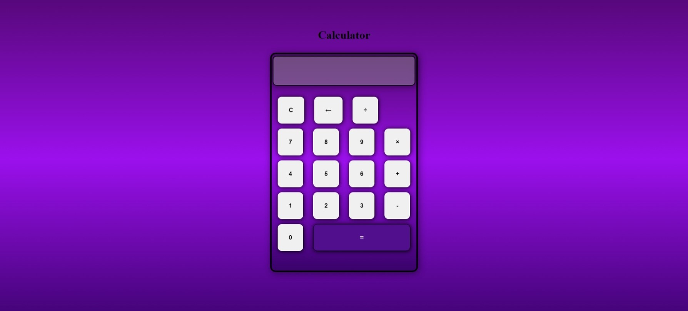

<h1 style="font-size: 30px;">Responsive Calculator Web Application</h1>

## Overview
A modern, responsive calculator application built using HTML, CSS, and JavaScript. This project offers a clean and intuitive interface for performing basic arithmetic operations while incorporating responsive design.

## Features
- **Basic Arithmetic Operations**:  
  Perform addition (`+`), subtraction (`−`), multiplication (`×`), and division (`÷`).

- **Utility Functions**:  
  - **Clear Button (`C`)**: Clears all inputs from the screen.  
  - **Backspace (`←`)**: Deletes the last entered character.  
  - **Equal Button (`=`)**: Computes the result of the entered expression.

- **Interactive UI**: Buttons with hover effects and animations for a tactile experience.

- **Responsive Design**: Works seamlessly on desktops, tablets, and mobile devices.

## Screenshots

## **Main Interface**

---
### Built With:

    

## License

This project is licensed under the MIT License - see the [LICENSE](MIT-LICENSE) file for details.
